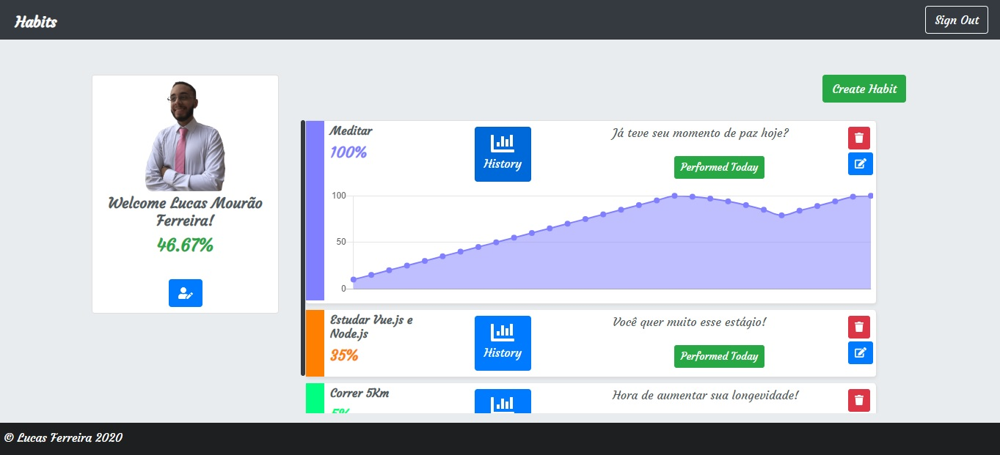
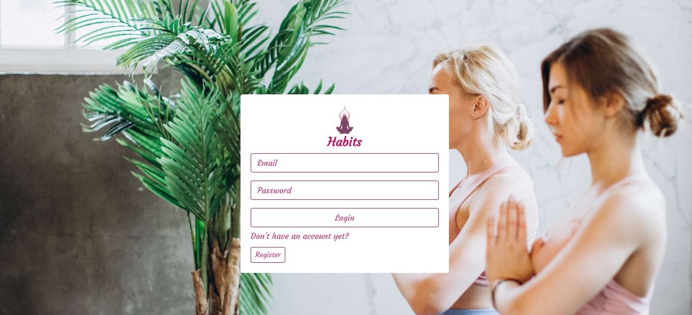

# habit-tracker

## Descrição

Projeto de uma aplicação WEB que busca imitar um aplicativo habit tracker. A aplicação realiza operações CRUD com as entidades Usuário(user) e Hábito(habit) e calcula o progresso do usuário em relação aos seus hábitos
(O cálculo é descrito na ultima seção do README.md). O sistema também conta com autenticação de usuário por JWT.

O backend foi desenvolvido com banco de dados MongoDB e Node.js, e consiste em uma API REST,
já o frontend da aplicação foi desenvolvido com Vue.js.

## Como executar:

1ª - Certifique-se que possui o MongoDB instalado e o inicialize.
<br>
<b>No Windows:</b>
```
mongod --version
```
```
mongod
```
2ª - Na pasta backend-nodejs, execute os comandos:
<br>
(O backend da aplicação utiliza a porta :8080, verifique se não possui outra aplicação na porta)
<br>
```
npm install
```
```
npm run start
```
3ª - Na pasta frontend-vuejs/habit-tracker, execute o comando:
```
npm install
```
4ª - Na pasta frontend-vuejs/habit-tracker/src, execute o comando:
```
vue serve
```

## Tecnologias Utilizadas:
npm 6.13.4

### Backend:
<ul>
<li>node.js 12.16.1</li>
<li>mongodb 4.2.3</li>
<li>async 3.2.0</li>
<li>bcryptjs 2.4.3</li>
<li>body-parser 1.19.0</li>
<li>express 4.17.1</li>
<li>jsonwebtoken 8.5.1</li>
<li> mongoose 5.9.5</li>
<li>multer 1.4.2</li>
</ul>

### Frontend:
<ul>
<li>vue.js 2.6.11</li>
<li>vue-resource 1.5.1</li>
<li>vue-router 3.1.5</li>
<li>vuex 3.1.2</li>
<li>core-js 3.6.4</li>
<li>chart.js 2.9.3</li>
<li>vue-chartkick 0.6.0</li>
<li>bootstrap-vue 2.7.0</li>
<li>bootstrap 4.4.1</li>
<li>vue-fontawesome 0.1.9</li>
</ul>

## Preview




## Cálculo da porcentagem do hábito:

A aplicação considera que todos os hábitos são diários.

Sempre que o usuário realiza o hábito a porcentagem do hábito é acrescida de 5% até atingir o limite de 100%.

Caso o usuário fique um ou mais dias sem realizar o hábito (informar a aplicação) a seguinte equação é utilizada para calcular a perda:

<b>(Perda Base) = (100 - (5 * Máximo de dias consecutivos realizando o hábito))<br>
(Perda Base) = (Perda Base) < 1 ? 1 : (Perda Base)<br>
(Perda no dia) = (Perda Base)*(Dias consecutivos não realizando o hábito)<br>
(Porcentagem atual) = ((Porcentagem atual)-(Perda no dia)) < 0 ? 0 : ((Porcentagem atual)-(Perda no dia))</b>

A porcentagem geral do usuário é a média aritmética da porcentagem atual dos seus hábitos.
